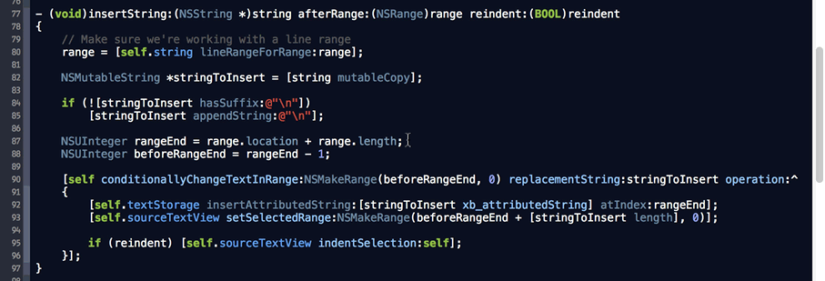
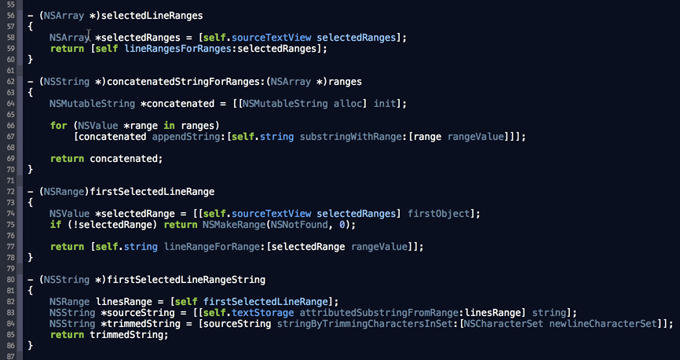
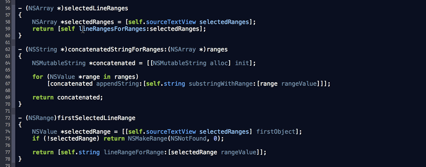
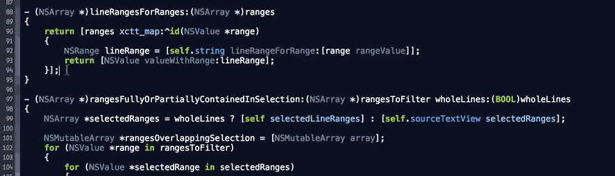
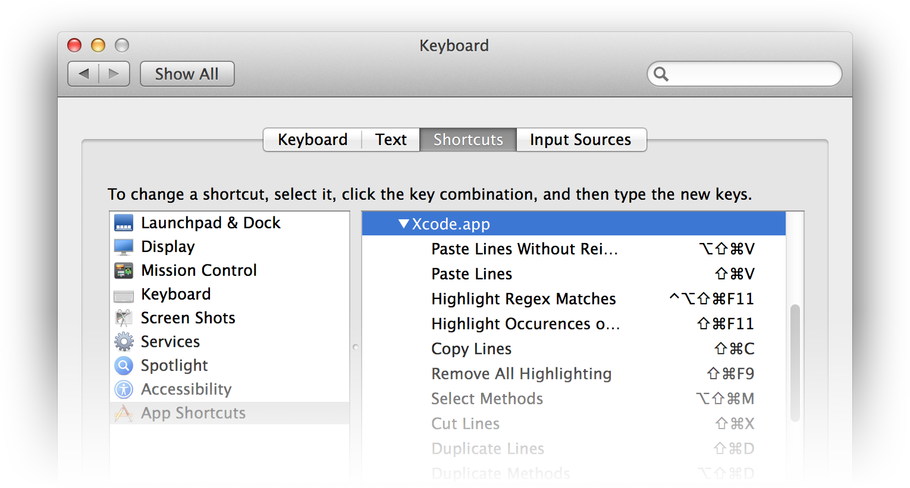
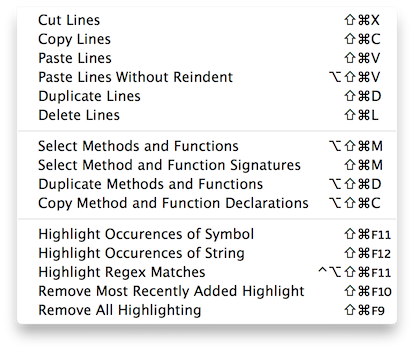

XcodeBoost
==========

An Xcode plugin that makes altering and inspecting Objective-C code quick and easy.

XcodeBoost automates some tedious operations such as **extracting method declarations from definitions** for insertion into a header file, adds **line-based code manipulation** (cut/copy/paste/duplicate/delete lines), **persistent highlighting** and more!

*Contributions are welcome! :)*

#### Symbol Highlighting

Notice the indicators in the scrollbar. They show where the symbols have been found in the current file, just like errors and warnings.

#### Method Definition and Signature Selection

#### Copy Method Declarations

#### Regex Match Highlighting

#### Paste Lines (with or without reindent)

*Pastes the copied string after the selected lines, unlike Xcode's "Paste" and "Paste and Preserve Formatting" which paste everything at the exact caret position. No need to precisely position the caret; code will be pasted on the next line.*

#### ... and more!

## Installation

1. Install through [Alcatraz](https://github.com/supermarin/Alcatraz) or download the source and build the XcodeBoost target, then restart Xcode.
2. Assign keyboard shortcuts to XcodeBoost's menu items through System Preferences' *Keyboard Shortcuts* panel.
	- Add Xcode.app in "App Shortcuts" if not already present.
	- For each XcodeBoost menu item that you wish to trigger using the keyboard, add a shortcut and fill the "Menu Title" field with the exact name of the menu item, like so:
	
	
	
	- Suggested keyboard shortcuts:
	
	
	
## Like the color theme in those screenshots?

You can also install the [Irradiated](https://github.com/fortinmike/irradiated-xcode-theme) color theme using Alcatraz.